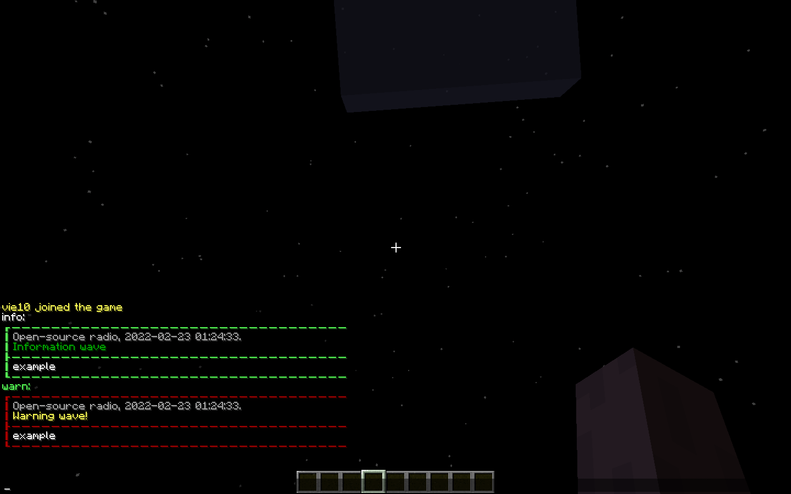

# Radio

Radio is a Minecraft Servers plugin for providing the best experience of interaction with broadcasting.

## Installation

Download required version from **RELEASES** or build it yourself using `allJars`. Then put it in your server plugins
folder.

## Benefits
- Customizable permission system (manage commands and styles that your players can use).
- Suggestions system (your players can suggest you news for broadcast).
- Easy customization (every message used in the plugin can be edited in a config).
- Different styles for every broadcast (declare so many as you want in a config).
- Open-source (full access to the plugin code and a chance make it better).
- Smart configuration system (declare variables and then use it for easy config changes)

## Visuals

## Gratitude
- [Koin](https://github.com/InsertKoinIO/koin) — smart Kotlin injection library used in the plugin.
- [Hoplite](https://github.com/sksamuel/hoplite) — powerful config system used in the plugin.
- [Mockk](https://github.com/mockk/mockk), [Kotest](https://github.com/kotest/kotest) — powerful tools for testing the plugin code.
- Contributors for their contributions that makes the plugin better.

## Contributing

Pull requests are welcome. For major changes, please open an issue first to discuss what you would like to change.

Please make sure to update tests as appropriate.

## Metrics

## License

[MIT](https://choosealicense.com/licenses/mit/)
